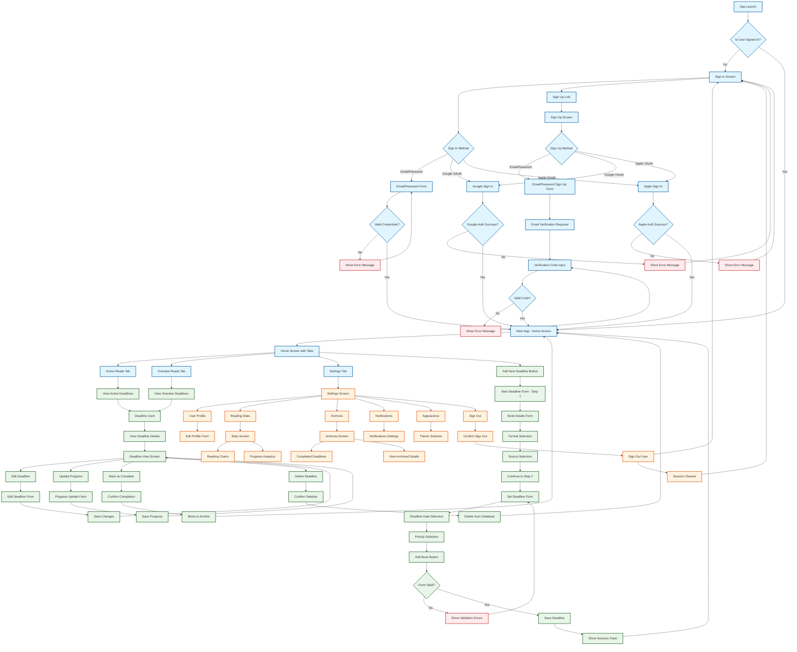

# R-R-Books App Flow Diagram

This diagram shows the complete navigation flow of the R-R-Books app, starting from the authentication screens and following through all the main user journeys.

## Flow Description

### Authentication Flow
1. **App Launch**: The app starts and checks if the user is already signed in
2. **Sign In Options**: Users can sign in via email/password, Google OAuth, or Apple OAuth
3. **Sign Up Process**: New users can create accounts with email verification
4. **Error Handling**: Invalid credentials or failed OAuth attempts return to sign-in

### Main App Navigation
1. **Home Screen**: Features two main tabs - Active Reads and Overdue Reads
2. **Deadline Management**: Users can view, add, edit, and manage reading deadlines
3. **Settings**: Access to user profile, stats, archives, and app settings

### Deadline Workflow
1. **Add New Deadline**: Two-step form process for creating reading deadlines
2. **View Deadlines**: Detailed view with progress tracking and charts
3. **Manage Deadlines**: Edit, update progress, complete, or delete deadlines

### Settings & Features
1. **User Profile**: Edit user information and preferences
2. **Reading Stats**: View analytics and progress charts
3. **Archives**: Access completed reading deadlines
4. **App Settings**: Notifications, appearance, and sign out options

This flow diagram represents the complete user journey through the R-R-Books app, from initial authentication to all major features and interactions. 