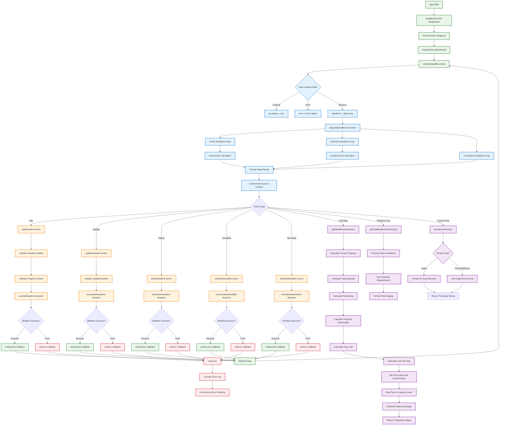

# DeadlineProvider Context Flow

This diagram shows the complete data flow and state management within the DeadlineProvider context, which manages all deadline-related operations in the R-R-Books app.

## DeadlineProvider Context Description

### Initialization Flow
1. **Provider Setup**: DeadlineProvider wraps PaceProvider and DeadlineProviderInternal
2. **Data Loading**: useGetDeadlines hook fetches deadline data
3. **State Management**: Loading, error, and success states handled
4. **Data Processing**: Deadlines separated into active, overdue, and completed

### Core Actions
1. **Add Deadline**: Validates details and creates new deadline
2. **Update Deadline**: Modifies existing deadline with validation
3. **Delete Deadline**: Removes deadline from database
4. **Complete Deadline**: Marks deadline as completed and moves to archive
5. **Set Aside Deadline**: Temporarily sets deadline aside

### Calculation Services
1. **Deadline Calculations**: 
   - Progress tracking (current/total/remaining)
   - Time calculations (days left, units per day)
   - Pace integration with PaceProvider
   - Urgency level determination

2. **Reading Time Estimates**:
   - Daily reading time requirements
   - Format-specific calculations
   - Total workload assessment

3. **Display Formatting**:
   - Units per day formatting by format type
   - Time display conversions
   - Progress visualization data

### Data Flow
- **State**: Managed through React Context
- **Mutations**: Database operations via custom hooks
- **Calculations**: Real-time computation based on current data
- **Error Handling**: Comprehensive error logging and callback system
- **Refresh**: Automatic data refresh after successful operations

### Integration
- **PaceProvider**: Provides pace-based calculations and status
- **Custom Hooks**: Database operations and data fetching
- **Utility Libraries**: Progress and deadline calculations
- **Component Usage**: Context consumed throughout app for deadline management 