# PaceProvider Context Flow

This diagram shows the complete data flow and pace calculation logic within the PaceProvider context, which manages reading and listening pace analysis in the R-R-Books app.

```mermaid
flowchart TD
    %% Entry Point
    A[PaceProvider Initialization] --> B[Receive Deadlines Prop]
    B --> C[Context Setup]
    
    %% User Pace Calculation
    C --> D[Calculate User Reading Pace]
    D --> E[calculateUserPace Function]
    E --> F[Filter Reading Deadlines]
    F --> G[Analyze Recent Progress Data]
    G --> H{Sufficient Data Available?}
    H -->|Yes| I[Calculate Average Pages/Day]
    H -->|No| J[Use Default Fallback Pace]
    I --> K[Set isReliable = true]
    J --> L[Set isReliable = false]
    K --> M[Reading Pace Data Ready]
    L --> M
    
    %% User Listening Pace Calculation
    C --> N[Calculate User Listening Pace]
    N --> O[calculateUserListeningPace Function]
    O --> P[Filter Audio Deadlines]
    P --> Q[Analyze Recent Listening Data]
    Q --> R{Sufficient Audio Data?}
    R -->|Yes| S[Calculate Average Minutes/Day]
    R -->|No| T[Use Default Audio Pace]
    S --> U[Set isReliable = true]
    T --> V[Set isReliable = false]
    U --> W[Listening Pace Data Ready]
    V --> W
    
    %% Context State Ready
    M --> X[Context State Ready]
    W --> X
    X --> Y[Components Access Context]
    
    %% Deadline Pace Status Calculation
    Y --> Z[getDeadlinePaceStatus Called]
    Z --> AA[Extract Deadline Details]
    AA --> BB[Calculate Current Progress]
    BB --> CC[Calculate Total Quantity]
    CC --> DD[Calculate Days Left]
    DD --> EE[Calculate Progress Percentage]
    
    %% Required Pace Calculation
    EE --> FF[calculateRequiredPace]
    FF --> GG{Format Type?}
    GG -->|Physical/Ebook| HH[Calculate Pages Required Per Day]
    GG -->|Audio| II[Calculate Minutes Required Per Day]
    HH --> JJ[Required Reading Pace Ready]
    II --> JJ
    
    %% User Pace Selection
    JJ --> KK{Deadline Format?}
    KK -->|Physical/Ebook| LL[Use Reading Pace Data]
    KK -->|Audio| MM[Use Listening Pace Data]
    LL --> NN[Extract User Pace]
    MM --> NN
    
    %% Pace Status Determination
    NN --> OO[getPaceBasedStatus]
    OO --> PP[Compare User vs Required Pace]
    PP --> QQ{Status Analysis}
    QQ -->|Progress Complete| RR[Status: Completed]
    QQ -->|Past Deadline| SS[Status: Overdue]
    QQ -->|Impossible Pace| TT[Status: Impossible]
    QQ -->|User Pace >= Required| UU[Status: Good]
    QQ -->|Close to Required| VV[Status: Approaching]
    
    %% Status Color Assignment
    RR --> WW[Color: Green]
    SS --> XX[Color: Red]
    TT --> XX
    UU --> WW
    VV --> YY[Color: Orange]
    
    %% Status Message Generation
    WW --> ZZ[getPaceStatusMessage]
    XX --> ZZ
    YY --> ZZ
    ZZ --> AAA[Generate Detailed Message]
    AAA --> BBB{Pace Reliability?}
    BBB -->|Reliable| CCC[Include Specific Pace Info]
    BBB -->|Not Reliable| DDD[Include Fallback Warning]
    CCC --> EEE[Format Status Message]
    DDD --> EEE
    
    %% Pace Display Formatting
    EEE --> FFF[formatPaceDisplay]
    FFF --> GGG{Format Type?}
    GGG -->|Physical/Ebook| HHH["Format as 'X pages/day'"]
    GGG -->|Audio| III["Format as 'Xh Ym/day'"]
    HHH --> JJJ[Pace Display Ready]
    III --> JJJ
    
    %% Return Calculation Object
    JJJ --> KKK[Compile Results Object]
    KKK --> LLL[Return Complete Status Data]
    
    %% Utility Functions
    Y --> MMM[formatPaceForFormat Called]
    MMM --> NNN[Format Pace for Specific Format]
    NNN --> OOO[Return Formatted String]
    
    Y --> PPP[getUserPaceReliability Called]
    PPP --> QQQ[Return Reading Pace Reliability]
    
    Y --> RRR[getUserPaceMethod Called]
    RRR --> SSS[Return Calculation Method]
    
    Y --> TTT[getUserListeningPaceReliability Called]
    TTT --> UUU[Return Listening Pace Reliability]
    
    Y --> VVV[getUserListeningPaceMethod Called]
    VVV --> WWW[Return Listening Calculation Method]
    
    %% Error Handling
    H --> XXX[Insufficient Reading Data]
    R --> YYY[Insufficient Audio Data]
    XXX --> ZZZ[Log Warning - Using Defaults]
    YYY --> ZZZ
    
    %% Styling
    classDef initNode fill:#e8f5e8,stroke:#2e7d32,stroke-width:2px
    classDef dataNode fill:#e3f2fd,stroke:#1976d2,stroke-width:2px
    classDef calculationNode fill:#f3e5f5,stroke:#7b1fa2,stroke-width:2px
    classDef statusNode fill:#fff3e0,stroke:#f57c00,stroke-width:2px
    classDef utilityNode fill:#f1f8e9,stroke:#558b2f,stroke-width:2px
    classDef errorNode fill:#ffebee,stroke:#c62828,stroke-width:2px
    classDef successNode fill:#e8f5e8,stroke:#388e3c,stroke-width:2px
    
    class A,B,C,X,Y initNode
    class F,G,P,Q,AA,BB,CC,DD,EE dataNode
    class E,O,FF,GG,HH,II,OO,PP,FFF,GGG,HHH,III,KKK calculationNode
    class QQ,RR,SS,TT,UU,VV,WW,XX,YY,ZZ,AAA,BBB,CCC,DDD,EEE statusNode
    class MMM,NNN,OOO,PPP,QQQ,RRR,SSS,TTT,UUU,VVV,WWW utilityNode
    class XXX,YYY,ZZZ errorNode
    class JJJ,LLL,M,W successNode
```

## PaceProvider Context Description

### Initialization and Data Processing
1. **Context Setup**: Receives deadlines array as prop
2. **Reading Pace Calculation**: 
   - Analyzes recent reading progress across all deadlines
   - Calculates average pages per day
   - Determines reliability based on data sufficiency
3. **Listening Pace Calculation**:
   - Analyzes audio book listening patterns
   - Calculates average minutes per day
   - Separate reliability assessment for audio data

### Core Pace Calculations
1. **User Pace Analysis**:
   - **Data Sources**: Recent progress updates from deadlines
   - **Reading Pace**: Pages per day from physical/ebook deadlines
   - **Listening Pace**: Minutes per day from audio deadlines
   - **Reliability**: Based on sufficient recent data points
   - **Fallback**: Default paces when insufficient data

2. **Required Pace Calculation**:
   - **Per Deadline**: Calculates needed daily pace to meet deadline
   - **Format Specific**: Different calculations for pages vs minutes
   - **Time Sensitive**: Adjusts based on remaining days

### Status Determination System
1. **Pace Comparison**:
   - **User Pace vs Required Pace**: Core comparison logic
   - **Status Levels**: Completed, Overdue, Impossible, Good, Approaching
   - **Color Coding**: Green (good), Orange (warning), Red (critical)

2. **Status Categories**:
   - **Completed**: Progress is 100%
   - **Overdue**: Past deadline date
   - **Impossible**: Required pace exceeds reasonable limits
   - **Good**: User pace meets or exceeds requirement
   - **Approaching**: User pace close to requirement (needs attention)

### Message Generation
1. **Contextual Messages**:
   - **Pace Reliability**: Different messages for reliable vs fallback data
   - **Format Specific**: Tailored for reading vs listening
   - **Actionable Guidance**: Specific recommendations based on status

2. **Display Formatting**:
   - **Reading Pace**: "X pages/day" format
   - **Listening Pace**: "Xh Ym/day" format with hour/minute breakdown
   - **Consistent**: Unified formatting across the app

### Utility Functions
1. **Pace Formatting**: Convert raw numbers to user-friendly displays
2. **Reliability Checks**: Access to pace calculation confidence levels
3. **Method Transparency**: Insight into whether data or defaults were used
4. **Format Agnostic**: Functions work across all book formats

### Data Flow and Performance
1. **Memoization**: Expensive calculations cached with useMemo
2. **Real-time Updates**: Recalculates when deadline data changes
3. **Efficient Processing**: Optimized for frequent status checks
4. **Context Integration**: Seamless integration with DeadlineProvider

### Error Handling and Fallbacks
1. **Insufficient Data**: Graceful degradation to default paces
2. **Calculation Errors**: Safe fallbacks for edge cases
3. **Logging**: Warning logs for troubleshooting
4. **User Communication**: Clear indication when using fallback data 