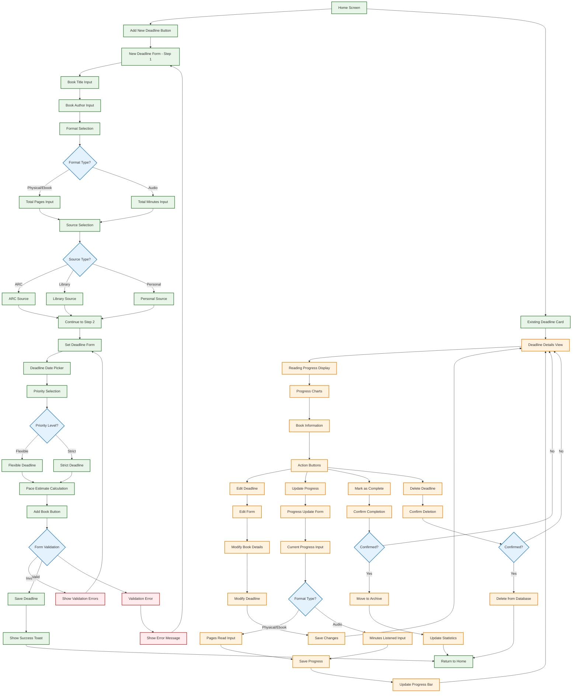

# Deadline Management Workflow

This diagram shows the detailed workflow for managing reading deadlines in the R-R-Books app.

## Deadline Workflow Description

### Adding New Deadlines
1. **Step 1 - Book Details**:
   - Book title and author
   - Format selection (Physical, Ebook, Audio)
   - Total quantity (pages or minutes)
   - Source selection (ARC, Library, Personal)

2. **Step 2 - Deadline Setting**:
   - Deadline date selection
   - Priority level (Flexible/Strict)
   - Pace estimate calculation
   - Form validation and submission

### Managing Existing Deadlines
1. **View Details**: Complete deadline information with progress
2. **Edit Deadline**: Modify book details or deadline date
3. **Update Progress**: Track reading progress by format
4. **Mark Complete**: Move finished books to archive
5. **Delete Deadline**: Remove unwanted deadlines

### Progress Tracking
- **Physical/Ebook**: Track pages read
- **Audio**: Track minutes listened
- **Visual Progress**: Progress bars and charts
- **Pace Calculation**: Automatic reading pace estimates

### Error Handling
- **Form Validation**: Real-time validation feedback
- **Confirmation Dialogs**: For destructive actions
- **Success Feedback**: Toast notifications for completed actions

This workflow ensures users can effectively manage their reading deadlines with proper validation and user feedback throughout the process. 