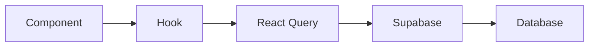
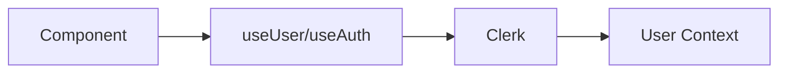
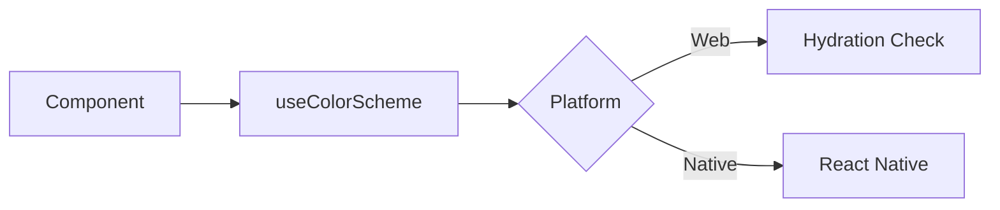

# Hooks Flow Documentation

This directory contains Mermaid flow charts documenting the behavior and data flow of all hooks in the application.

## Overview

The application uses a comprehensive set of custom hooks to manage:
- **Authentication**: User management and authentication state
- **Data Management**: CRUD operations for deadlines, achievements, and reading history
- **UI/UX**: Theme detection and platform-specific optimizations
- **Performance**: Browser optimization and caching strategies

## Flow Charts

### Individual Hook Documentation

1. **[useColorScheme](./useColorScheme.md)**
   - Cross-platform theme detection
   - Web hydration handling
   - Native platform integration

2. **[useWarmUpBrowser](./useWarmUpBrowser.md)**
   - Android browser optimization
   - Resource management
   - Cross-platform compatibility

3. **[useAchievementsQuery](./useAchievementsQuery.md)**
   - Achievement data fetching and caching
   - Optimistic updates for unlocking
   - Progress tracking and calculations

4. **[useDeadlines](./useDeadlines.md)**
   - Comprehensive deadline CRUD operations
   - Progress tracking and status management
   - Archived deadline handling

5. **[useReadingHistory](./useReadingHistory.md)**
   - Historical data analysis
   - Calendar data generation
   - Summary statistics calculation

6. **[Overview](./overview.md)**
   - Complete system architecture
   - Hook relationships and dependencies
   - Integration patterns

## Key Patterns

### Data Flow

### Authentication Flow

### Theme Flow

## Hook Categories

### Authentication & User Management
- **useUser**: Clerk user authentication
- **useAuth**: Clerk authentication context

### Data Management
- **useDeadlines**: Comprehensive deadline management
- **useAchievementsQuery**: Achievement system integration
- **useReadingHistory**: Historical data analysis

### UI/UX
- **useColorScheme**: Cross-platform theme detection
- **useTheme**: Theme context management

### Performance
- **useWarmUpBrowser**: Android browser optimization

## Dependencies

### Core Libraries
- `@tanstack/react-query`: Data fetching and caching
- `@clerk/clerk-expo`: Authentication
- `@/lib/supabase`: Database operations

### Platform Libraries
- `react-native`: Native platform features
- `expo-web-browser`: Cross-platform browser operations
- `react`: Core React functionality

## Best Practices

### Caching Strategy
- Use React Query for automatic caching
- Implement stale time configurations
- Optimize background updates

### Error Handling
- Implement proper error boundaries
- Use optimistic updates with rollback
- Provide user-friendly error messages

### Performance Optimization
- Memoize expensive calculations
- Use platform-specific optimizations
- Implement proper cleanup functions

## Development Guidelines

### Adding New Hooks
1. Create the hook file in `src/hooks/`
2. Add TypeScript types and interfaces
3. Implement proper error handling
4. Add comprehensive tests
5. Create flow chart documentation

### Testing Hooks
- Use React Testing Library
- Mock external dependencies
- Test error scenarios
- Verify cleanup functions

### Documentation
- Update flow charts when hook behavior changes
- Document new dependencies
- Explain complex business logic
- Provide usage examples

## Related Documentation

- [Components Flow](../components/README.md)
- [Services Flow](../services/README.md)
- [Contexts Flow](../contexts/README.md)
- [Development Guide](../../DEVELOPMENT.md) 