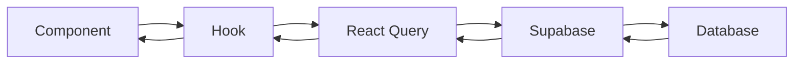
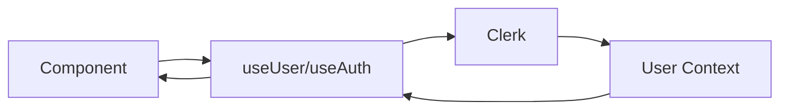
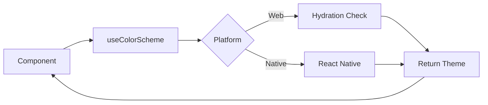

# Hooks Overview Flow Chart

## Overview
This document provides a comprehensive view of all hooks in the application and their relationships to different parts of the system.

## Flow Chart

```mermaid
flowchart TD
    A[Application Hooks] --> B[Authentication Hooks]
    A --> C[Data Management Hooks]
    A --> D[UI/UX Hooks]
    A --> E[Performance Hooks]
    
    B --> F[useUser - Clerk Authentication]
    B --> G[useAuth - Clerk Auth Context]
    
    C --> H[useDeadlines - Deadline CRUD]
    C --> I[useAchievementsQuery - Achievement Management]
    C --> J[useReadingHistory - History Analysis]
    
    D --> K[useColorScheme - Theme Detection]
    D --> L[useTheme - Theme Context]
    
    E --> M[useWarmUpBrowser - Browser Optimization]
    
    H --> N[useAddDeadline]
    H --> O[useUpdateDeadline]
    H --> P[useDeleteDeadline]
    H --> Q[useUpdateDeadlineProgress]
    H --> R[useGetDeadlines]
    H --> S[useCompleteDeadline]
    H --> T[useSetAsideDeadline]
    H --> U[useGetArchivedDeadlines]
    
    I --> V[Fetch Achievements]
    I --> W[Unlock Achievements]
    I --> X[Progress Tracking]
    
    J --> Y[Date Range Filtering]
    J --> Z[Format Filtering]
    J --> AA[Calendar Data Generation]
    J --> BB[Summary Statistics]
    
    K --> CC[Platform Detection]
    K --> DD[Hydration Handling]
    
    M --> EE[Android Browser Warm-up]
    M --> FF[Browser Cool-down]
    
    N --> GG[Supabase Insert]
    O --> HH[Supabase Update]
    P --> II[Supabase Delete]
    Q --> JJ[Progress Tracking]
    R --> KK[Data Fetching]
    S --> LL[Status Management]
    T --> MM[Status Management]
    U --> NN[Archived Data]
    
    V --> OO[Achievement Service]
    W --> PP[Optimistic Updates]
    X --> QQ[Progress Calculation]
    
    Y --> RR[Date Calculations]
    Z --> SS[Format Filtering]
    AA --> TT[Calendar Integration]
    BB --> UU[Statistics Calculation]
    
    CC --> VV[React Native]
    DD --> WW[Web Platform]
    
    EE --> XX[Expo Web Browser]
    FF --> YY[Resource Management]
    
    GG --> ZZ[Database Operations]
    HH --> ZZ
    II --> ZZ
    JJ --> ZZ
    KK --> ZZ
    LL --> ZZ
    MM --> ZZ
    NN --> ZZ
    
    OO --> AAA[Business Logic]
    PP --> BBB[React Query]
    QQ --> CCC[Progress Algorithms]
    
    RR --> DDD[Date Utilities]
    SS --> EEE[Format Utilities]
    TT --> FFF[Calendar Components]
    UU --> GGG[Math Operations]
    
    VV --> HHH[Native Platform]
    WW --> III[Web Platform]
    
    XX --> JJJ[Browser APIs]
    YY --> KKK[Memory Management]
```

## Hook Categories

### Authentication & User Management
- **useUser**: Clerk user authentication
- **useAuth**: Clerk authentication context

### Data Management
- **useDeadlines**: Comprehensive deadline management
- **useAchievementsQuery**: Achievement system integration
- **useReadingHistory**: Historical data analysis

### UI/UX
- **useColorScheme**: Cross-platform theme detection
- **useTheme**: Theme context management

### Performance
- **useWarmUpBrowser**: Android browser optimization

## Data Flow Patterns

### CRUD Operations

### Authentication Flow

### Theme Flow

## Integration Points

### Database Integration
- **Supabase**: All data operations
- **React Query**: Caching and state management
- **Clerk**: Authentication and user management

### Platform Integration
- **React Native**: Native platform features
- **Expo**: Cross-platform capabilities
- **Web**: Browser-specific optimizations

### UI Integration
- **Theme System**: Consistent theming
- **Calendar Components**: Date visualization
- **Progress Tracking**: Real-time updates

## Performance Considerations

### Caching Strategy
- **React Query**: Automatic caching and background updates
- **Memoization**: Optimized re-renders
- **Stale Time**: Configurable cache invalidation

### Platform Optimization
- **Android**: Browser warm-up for authentication
- **Web**: Hydration-safe theme detection
- **Cross-platform**: Unified API with platform-specific implementations 