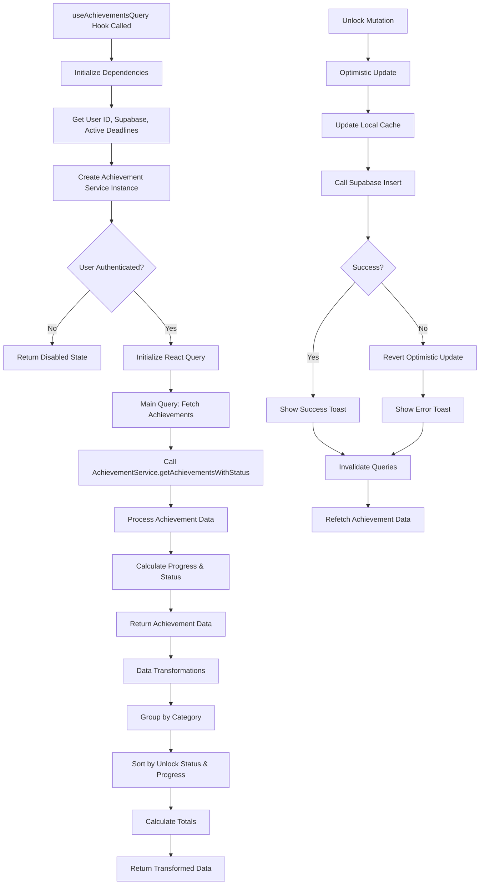

# useAchievementsQuery Hook Flow Chart

## Overview
The `useAchievementsQuery` hook manages achievement data fetching, caching, and unlocking operations using React Query for state management and optimistic updates.

## Flow Chart



## Key Features

### Data Management
- **React Query Integration**: Automatic caching, background updates, and error handling
- **Optimistic Updates**: Immediate UI feedback for unlock operations
- **Data Transformation**: Grouping, sorting, and progress calculations

### Achievement Operations
- **Fetch with Status**: Retrieves achievements with current unlock status and progress
- **Unlock Mutation**: Handles achievement unlocking with optimistic updates
- **Progress Tracking**: Real-time progress calculation and updates

### Caching Strategy
- **Stale Time**: 5 minutes before refetching
- **Cache Time**: 30 minutes for background retention
- **Smart Invalidation**: Targeted cache updates

## Usage Pattern
```typescript
const {
  achievements,
  achievementsByCategory,
  totalUnlocked,
  totalAchievements,
  isLoading,
  unlockAchievement,
  isUnlocking
} = useAchievementsQuery();
```

## Dependencies
- `@tanstack/react-query` (for data fetching and caching)
- `@clerk/clerk-expo` (for authentication)
- `@/services/achievementService` (for business logic)
- `@/lib/supabase` (for database operations)
- `@/contexts/DeadlineProvider` (for active deadlines) 