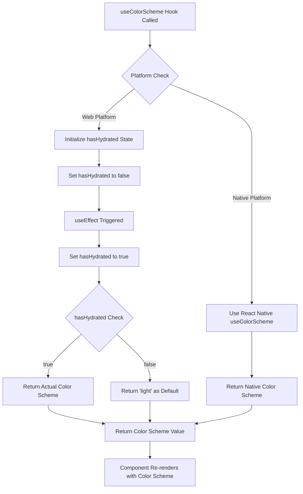

# useColorScheme Hook Flow Chart

## Overview
The `useColorScheme` hook provides color scheme detection for React Native applications, with special handling for web platforms to support static rendering.

## Flow Chart



## Key Features

### Web Platform Handling
- **Hydration Support**: Prevents hydration mismatches by defaulting to 'light' until client-side hydration is complete
- **State Management**: Uses `useState` to track hydration status
- **Effect Cleanup**: Automatically updates hydration status on mount

### Native Platform Handling
- **Direct Passthrough**: Uses React Native's built-in `useColorScheme` hook
- **No Additional Logic**: Minimal overhead for native platforms

## Usage Pattern
```typescript
const colorScheme = useColorScheme();
// Returns: 'light' | 'dark' | null
```

## Dependencies
- `react-native` (for native platform)
- `react` (for web platform state management) 