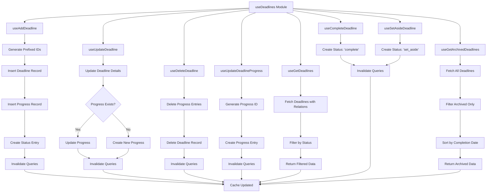

# useDeadlines Hook Flow Chart

## Overview
The `useDeadlines` module provides a comprehensive set of hooks for managing reading deadlines, including CRUD operations, progress tracking, and status management.

## Flow Chart



## Key Features

### CRUD Operations
- **Add Deadline**: Creates new deadline with progress and status tracking
- **Update Deadline**: Modifies existing deadline and associated progress
- **Delete Deadline**: Removes deadline and all related data
- **Progress Updates**: Tracks reading progress with timestamps

### Status Management
- **Active Deadlines**: Filter for currently reading deadlines
- **Complete Deadlines**: Mark deadlines as completed
- **Set Aside**: Temporarily pause deadlines
- **Archived View**: Separate view for completed/set aside deadlines

### Data Relationships
- **Deadline → Progress**: One-to-many relationship for progress tracking
- **Deadline → Status**: One-to-many relationship for status history
- **User → Deadlines**: User-specific deadline management

## Usage Patterns

### Adding a Deadline
```typescript
const addDeadline = useAddDeadline();
addDeadline.mutate({
  deadlineDetails: { /* deadline data */ },
  progressDetails: { /* progress data */ }
});
```

### Fetching Deadlines
```typescript
const { data: deadlines, isLoading } = useGetDeadlines();
const { data: archived } = useGetArchivedDeadlines();
```

### Updating Progress
```typescript
const updateProgress = useUpdateDeadlineProgress();
updateProgress.mutate({
  deadlineId: 'rd_123',
  currentProgress: 150
});
```

### Status Changes
```typescript
const completeDeadline = useCompleteDeadline();
const setAsideDeadline = useSetAsideDeadline();
```

## Dependencies
- `@tanstack/react-query` (for data fetching and caching)
- `@clerk/clerk-expo` (for user authentication)
- `@/lib/supabase` (for database operations)
- `@/types/deadline` (for TypeScript types) 