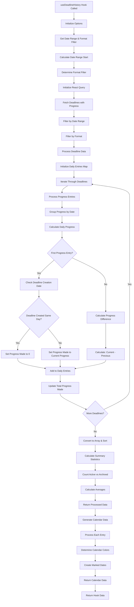

# useReadingHistory Hook Flow Chart

## Overview
The `useReadingHistory` hook provides comprehensive reading history analysis, including daily progress tracking, format filtering, and calendar data generation for visualization.

## Flow Chart



## Key Features

### Data Processing
- **Daily Aggregation**: Groups progress by date for calendar visualization
- **Progress Calculation**: Calculates daily progress differences and cumulative totals
- **Format Filtering**: Supports reading, listening, or combined format views
- **Date Range Filtering**: Configurable time periods (7d, 30d, 90d, 1y, all)

### Calendar Integration
- **Color Coding**: Different colors for reading, listening, and combined activities
- **Marked Dates**: Visual indicators for days with reading activity
- **Performance Optimization**: Memoized calendar data generation

### Summary Statistics
- **Total Days**: Count of days with reading activity
- **Total Progress**: Cumulative progress across all deadlines
- **Average Progress**: Daily average progress calculation
- **Active vs Archived**: Count of active vs completed deadlines

## Usage Pattern
```typescript
const {
  data,
  isLoading,
  calendarData,
  summary
} = useDeadlineHistory({
  dateRange: '90d',
  formatFilter: 'all'
});
```

## Data Structure

### Daily Entry
```typescript
interface DailyDeadlineEntry {
  date: string;
  deadlines: {
    id: string;
    book_title: string;
    format: 'physical' | 'ebook' | 'audio';
    progress_made: number;
    total_progress: number;
    // ... other fields
  }[];
  totalProgressMade: number;
}
```

### Summary Data
```typescript
interface Summary {
  totalDays: number;
  totalProgressMade: number;
  averageProgressPerDay: number;
  activeDeadlines: number;
  ArchivedDeadlines: number;
}
```

## Dependencies
- `@tanstack/react-query` (for data fetching and caching)
- `@clerk/clerk-expo` (for user authentication)
- `@/lib/supabase` (for database operations)
- `react` (for useMemo optimization) 