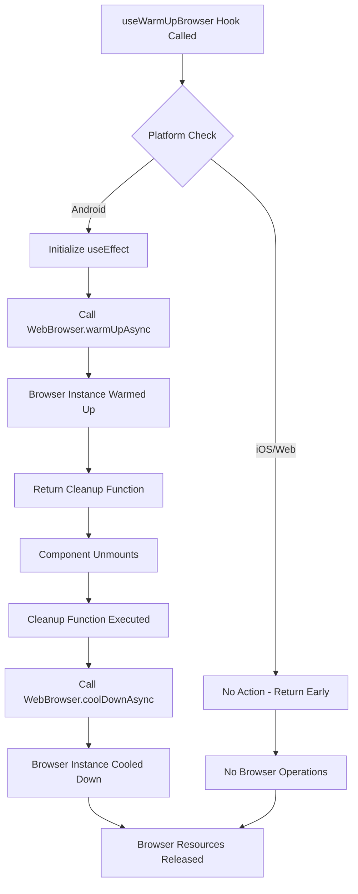

# useWarmUpBrowser Hook Flow Chart

## Overview
The `useWarmUpBrowser` hook optimizes web browser performance on Android devices by warming up the browser instance when the component mounts and cooling it down when unmounting.

## Flow Chart



## Key Features

### Android Platform Optimization
- **Warm Up**: Pre-initializes browser instance for faster subsequent launches
- **Cool Down**: Properly releases browser resources on unmount
- **Performance**: Reduces browser startup time for authentication flows

### Cross-Platform Compatibility
- **Platform Detection**: Only executes on Android platform
- **No Side Effects**: Safe to use on all platforms
- **Automatic Cleanup**: Ensures resources are properly released

## Usage Pattern
```typescript
const useWarmUpBrowser = () => {
  // Automatically handles warm-up and cool-down
  // No return value needed
};
```

## Dependencies
- `expo-web-browser` (for browser operations)
- `react-native` (for platform detection)
- `react` (for useEffect lifecycle) 