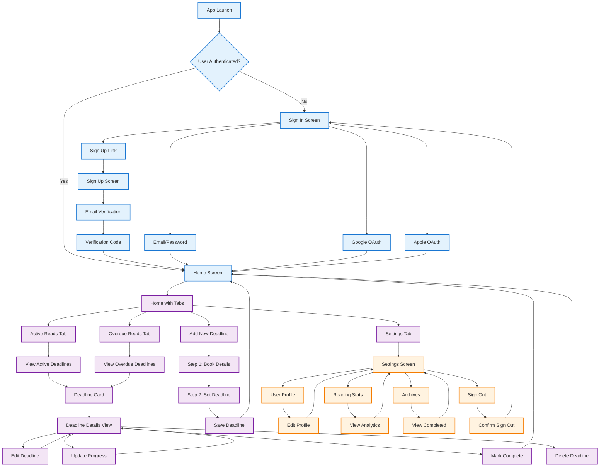

# Main Navigation Flow

This diagram shows the primary navigation paths through the R-R-Books app, focusing on the most common user journeys.

## Key Navigation Paths

### Authentication Flow
- **Sign In**: Multiple authentication methods (email/password, Google, Apple)
- **Sign Up**: Email verification required for new accounts
- **Auto-redirect**: Authenticated users go directly to home screen

### Main App Features
- **Home Screen**: Tabbed interface with Active/Overdue reads
- **Deadline Management**: View, add, edit, and manage reading deadlines
- **Settings**: User profile, stats, archives, and app settings

### Common User Journeys
1. **Add New Book**: Two-step form process
2. **Track Progress**: Update reading progress on existing deadlines
3. **View Analytics**: Access reading statistics and charts
4. **Manage Library**: View completed books in archives

This simplified flow focuses on the core user experience and most common navigation patterns. 