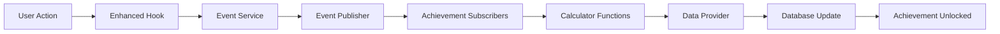

# Achievement System Documentation

A comprehensive event-driven achievement system for R&R Books that tracks reading progress and unlocks achievements in real-time.

## 🏗️ System Architecture

### Overview
The achievement system uses an **event-driven architecture** with the Observer pattern to provide real-time achievement tracking without performance overhead.

### Core Components

```
📂 /src/services/achievements/
├── 🎯 types.ts                    # Core type definitions and interfaces
├── 📢 AchievementEventPublisher.ts # Observer pattern event publishing  
├── ⚙️  AchievementEventService.ts   # Singleton service orchestrator
├── 📋 AchievementRegistry.ts       # Achievement configuration management
├── 👂 MetadataAchievementSubscriber.ts # Configurable event subscriber
├── 💾 SupabaseAchievementDataProvider.ts # Database integration layer
├── 🧮 AchievementCalculators.ts    # All achievement calculation functions
├── 🔄 AchievementMigrationUtils.ts # Migration and setup utilities
└── 📁 migrations/
    └── 001_achievement_system_tables.sql # Database schema
```

### Data Flow



## 🎮 Event System

### Event Types

| Event | Trigger | Data |
|-------|---------|------|
| `BOOK_STARTED` | New deadline created | bookId, format, totalPages, startedAt |
| `PROGRESS_UPDATED` | Reading progress updated | bookId, progressDelta, currentProgress |
| `DEADLINE_COMPLETED` | Book finished | bookId, completedAt, readingDurationDays |
| `BOOK_SET_ASIDE` | Book set aside | bookId, setAsideAt, reason |
| `DAILY_READING_SESSION` | Daily reading tracked | date, pagesRead, booksRead, duration |
| `READING_GOAL_SET` | New goal established | goalType, targetValue |
| `READING_STREAK_UPDATED` | Streak milestone reached | streakLength, streakType |

### Event Publishing

Events are automatically published through enhanced hooks:

```typescript
// Example: Publishing a progress update
await eventService.publishProgressUpdated(userId, {
  bookId: "deadline_123",
  format: "physical",
  progressDelta: 25,
  currentProgress: 150,
  totalPages: 300
});
```

## 🎯 Achievement Configuration

### Achievement Types

| Category | Examples | Persistence |
|----------|----------|-------------|
| **Volume** | Page Turner (1000 pages), Ambitious Reader (5 books) | CUMULATIVE |
| **Consistency** | 7-day streak, 30-day streak | SNAPSHOT |
| **Speed** | Speed Reader (50 pages/day) | TEMPORAL |
| **Diversity** | Format Explorer (3 formats) | CUMULATIVE |
| **Timing** | Early Finisher (beat deadline) | CUMULATIVE |

### Adding New Achievements

1. **Define Calculator Function** in `AchievementCalculators.ts`:
```typescript
private async calculateMyNewAchievement(
  context: EnhancedContext, 
  config: AchievementConfig
): Promise<number> {
  // Your calculation logic here
  return calculatedValue;
}
```

2. **Register Calculator**:
```typescript
this.calculators.set('calculateMyNewAchievement', this.calculateMyNewAchievement.bind(this));
```

3. **Add Configuration** in `AchievementMigrationUtils.ts`:
```typescript
{
  id: 'my_new_achievement',
  name: 'My New Achievement',
  description: 'Description of the achievement',
  calculatorFunction: 'calculateMyNewAchievement',
  subscribedEvents: [EventType.PROGRESS_UPDATED],
  persistenceStrategy: PersistenceType.CUMULATIVE,
  targetValue: 100,
  category: 'volume'
}
```

## 🔌 Integration Points

### Enhanced Hooks (src/hooks/)

The system integrates seamlessly through enhanced deadline hooks:

```typescript
// src/hooks/useDeadlinesWithAchievements.ts
import { 
  useAddDeadline,              // Auto-publishes BOOK_STARTED
  useUpdatebookProgress,   // Auto-publishes PROGRESS_UPDATED  
  useCompletebook,         // Auto-publishes DEADLINE_COMPLETED
  useSetAsidebook          // Auto-publishes BOOK_SET_ASIDE
} from './useDeadlinesWithAchievements';
```

### Achievement System Hooks

```typescript
// src/hooks/useAchievementSystem.ts
import {
  useInitializeAchievementSystem,  // Auto-initializes on app start
  useAchievementSystemProvider,    // Complete system management
  useTriggerAchievementCheck,      // Manual achievement refresh
  useAchievementSystemHealth       // System health monitoring
} from './useAchievementSystem';
```

### Daily Reading Sessions

```typescript
// src/hooks/useDailyReadingSession.ts
import {
  useTrackReadingSession,    // Track daily reading activity
  useGetReadingSessions,     // Get reading history
  useGetReadingStats         // Get statistics and streaks
} from './useDailyReadingSession';
```

## 💾 Database Schema

### Core Tables

```sql
-- Achievement progress tracking  
CREATE TABLE achievement_progress (
  id TEXT PRIMARY KEY,
  user_id TEXT NOT NULL,
  achievement_id TEXT NOT NULL,
  current_value NUMERIC DEFAULT 0,
  target_value NUMERIC NOT NULL,
  is_completed BOOLEAN DEFAULT FALSE,
  completed_at TIMESTAMP WITH TIME ZONE,
  UNIQUE(user_id, achievement_id)
);

-- Event audit trail
CREATE TABLE achievement_events (
  id TEXT PRIMARY KEY,
  user_id TEXT NOT NULL,
  event_type TEXT NOT NULL,
  event_data JSONB DEFAULT '{}',
  created_at TIMESTAMP WITH TIME ZONE DEFAULT NOW()
);
```

### Enhanced Deadline Fields

```sql
-- Additional columns added to reading_deadlines
ALTER TABLE reading_deadlines ADD COLUMN format TEXT DEFAULT 'physical';
ALTER TABLE reading_deadlines ADD COLUMN reading_duration_days INTEGER;
ALTER TABLE reading_deadlines ADD COLUMN set_aside BOOLEAN DEFAULT FALSE;
ALTER TABLE reading_deadlines ADD COLUMN completed_at TIMESTAMP WITH TIME ZONE;
```

## 🚀 Getting Started

### 1. System Initialization

The achievement system auto-initializes when the app starts:

```typescript
// Automatic initialization in app root
const { isReady, initialize } = useInitializeAchievementSystem();

// Manual initialization if needed
await initialize();
```

### 2. Publishing Events

Events are automatically published through enhanced hooks, but you can also publish manually:

```typescript
const eventService = AchievementEventService.getInstance();

// Publish a custom event
await eventService.publishProgressUpdated(userId, {
  bookId: "book_123",
  format: "ebook", 
  progressDelta: 30,
  currentProgress: 200,
  totalPages: 400
});
```

### 3. Checking Achievement Status

```typescript
// Get achievement system health
const { health, isHealthLoading } = useAchievementSystemHealth();

// Get achievement progress
const dataProvider = eventService.getDataProvider();
const progress = await dataProvider.getAchievementProgress(userId, 'page_turner');
```

## 🧪 Testing

### Test Structure

```
📂 __tests__/
├── AchievementDataProvider.test.ts      # Database integration tests
├── AchievementEventPublisher.test.ts    # Event publishing tests  
├── AchievementRegistry.test.ts          # Registry functionality tests
├── AchievementSystem.integration.test.ts # End-to-end integration tests
├── AchievementMigration.test.ts         # Migration and setup tests
└── MetadataAchievementSubscriber.test.ts # Subscriber behavior tests
```

### Running Tests

```bash
# Run all achievement tests
npm test achievements

# Run specific test files
npm test AchievementSystem.integration.test.ts
```

### Test Coverage

The system maintains comprehensive test coverage for:
- ✅ Event publishing and subscription
- ✅ Achievement calculation accuracy  
- ✅ Database integration and RLS policies
- ✅ Hook integration and state management
- ✅ Migration utilities and setup

## 🎯 Achievement Catalog

### Volume Achievements
- **Page Turner** (`page_turner`): Read 1,000 pages total
- **Ambitious Reader** (`ambitious_reader`): Read 5 books simultaneously

### Consistency Achievements  
- **Consistency Champion** (`consistency_champion`): 7-day reading streak
- **Dedicated Reader** (`dedicated_reader`): 25-day reading streak
- **Reading Habit Master** (`reading_habit_master`): 50-day reading streak
- **Reading Champion** (`reading_champion`): 75-day reading streak
- **Century Reader** (`century_reader`): 100-day reading streak
- **Half Year Scholar** (`half_year_scholar`): 180-day reading streak
- **Year Long Scholar** (`year_long_scholar`): 365-day reading streak
- **Reading Hero** (`reading_hero`): 500-day reading streak

### Speed Achievements
- **Speed Reader** (`speed_reader`): Read 50 pages in a single day
- **Marathon Listener** (`marathon_listener`): Listen for 8 hours in a single day

### Diversity Achievements
- **Format Explorer** (`format_explorer`): Read books in different formats

### Library Achievements
- **Library Warrior** (`library_warrior`): Read 10 library books

### Timing Achievements  
- **Early Finisher** (`early_finisher`): Complete a book ahead of deadline

## 🔧 Configuration

### Persistence Strategies

| Strategy | Description | Use Case |
|----------|-------------|----------|
| `CUMULATIVE` | Never resets, always accumulates | Total pages read, books completed |
| `SNAPSHOT` | Point-in-time value | Current reading streak |
| `TEMPORAL` | Time-based reset | Monthly reading goals |

## 🚨 Troubleshooting

### Common Issues

**Achievement system not initializing:**
```typescript
// Check system health
const { health } = useAchievementSystemHealth();
console.log(health);

// Force re-initialization  
const { retry } = useInitializeAchievementSystem();
await retry();
```

**Events not being published:**
```typescript
// Verify system is initialized
const { isReady } = useIsAchievementSystemReady();
if (!isReady) {
  // System needs initialization
}
```

**Achievement progress not updating:**
```typescript
// Manually trigger achievement check
const { triggerCheck } = useTriggerAchievementCheck();
await triggerCheck();
```

### Debug Tools

```typescript
// Get registry statistics
const registry = eventService.getRegistry();
const stats = registry.getStats();
console.log('Achievement system stats:', stats);

// Reset system for testing
const { reset } = useResetAchievementSystem();
await reset();
```

## 🔒 Security & Privacy

### Row Level Security (RLS)

All achievement tables enforce RLS policies:
- Users can only access their own achievement data
- Policies use `requesting_user_id()` for Clerk compatibility
- All operations (SELECT, INSERT, UPDATE, DELETE) are protected

### Data Privacy

- Achievement data is isolated per user
- Event data can be optionally logged for analytics
- No sensitive information is stored in achievement events

## 📈 Performance

### Optimizations

- **Event Batching**: Multiple events can be batched for efficiency
- **Lazy Loading**: Achievement system initializes only when needed
- **Database Indexing**: Optimized indexes for common queries
- **Context Caching**: Enhanced context is cached during event processing

### Monitoring

```typescript
// Monitor system health
const { health, refreshHealth } = useAchievementSystemProvider();

// Track performance metrics
const startTime = performance.now();
await eventService.publishEvent(event);
const duration = performance.now() - startTime;
```

## 🔄 Migration & Deployment

### Database Migration

Run the migration to set up the achievement system:

```sql
-- Apply the migration
\i src/services/achievements/migrations/001_achievement_system_tables.sql
```

### Deployment Checklist

- ✅ Run database migration
- ✅ Verify RLS policies are active  
- ✅ Test achievement system initialization
- ✅ Confirm enhanced hooks are integrated
- ✅ Validate event publishing works
- ✅ Check achievement calculations are accurate

## 🤝 Contributing

### Adding New Achievement Types

1. Create calculator function in `AchievementCalculators.ts`
2. Register the calculator in the constructor
3. Add configuration in `AchievementMigrationUtils.ts`
4. Add tests for the new achievement
5. Update this documentation

### Code Style

- Use TypeScript interfaces for all data structures
- Follow existing naming conventions
- Add comprehensive error handling
- Include JSDoc comments for all public methods
- Write tests for all new functionality

---

## 📚 Related Documentation

- [Database Schema](./migrations/001_achievement_system_tables.sql) - Complete database setup
- [Hooks Documentation](../../docs/flow/hooks/) - Integration hook details

---

**Last Updated**: January 2025  
**Version**: 1.0.0  
**Maintainers**: R&R Books Development Team